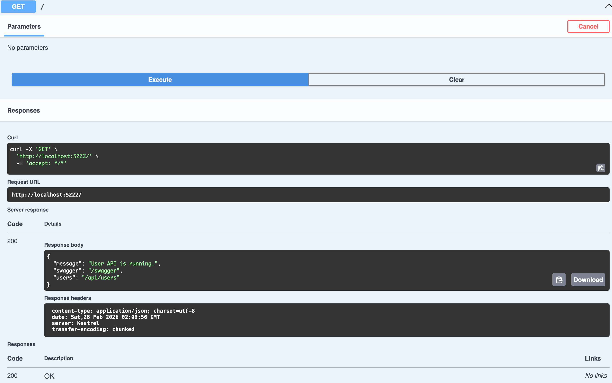
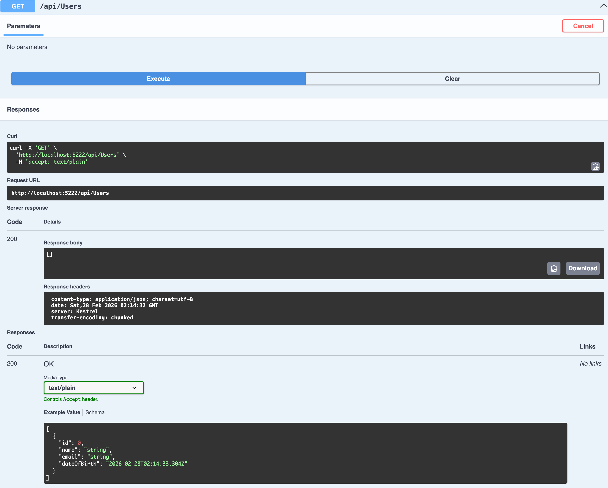
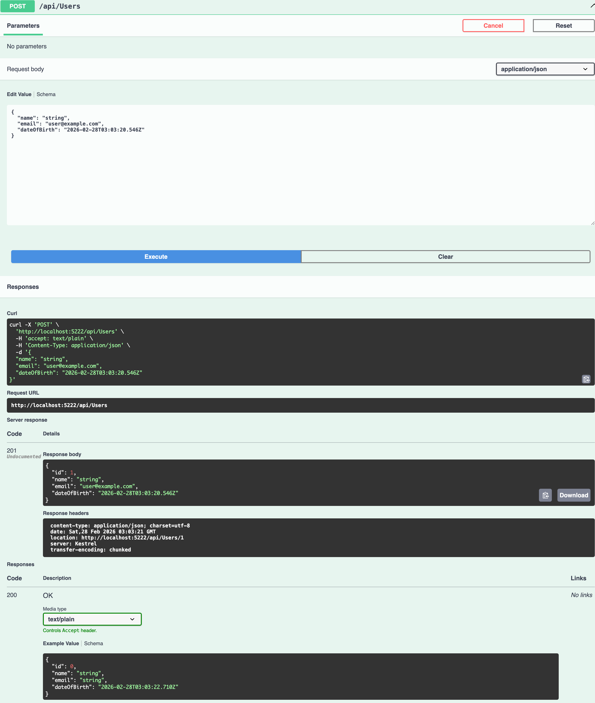
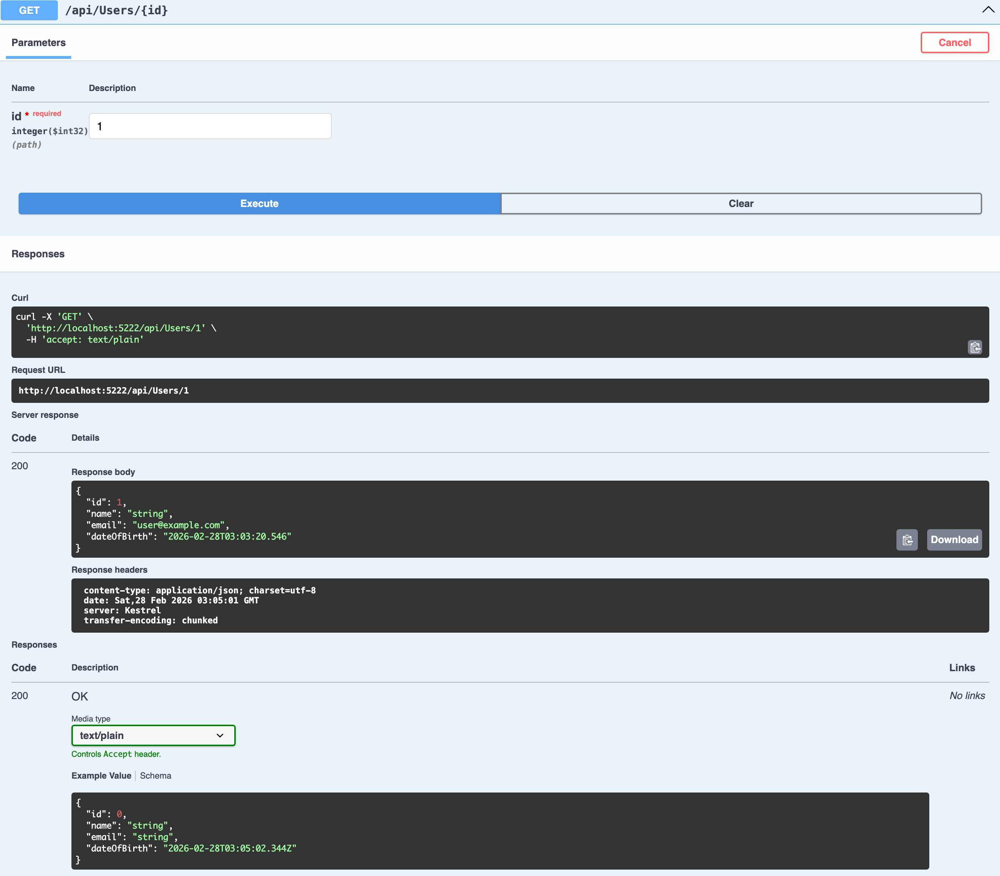
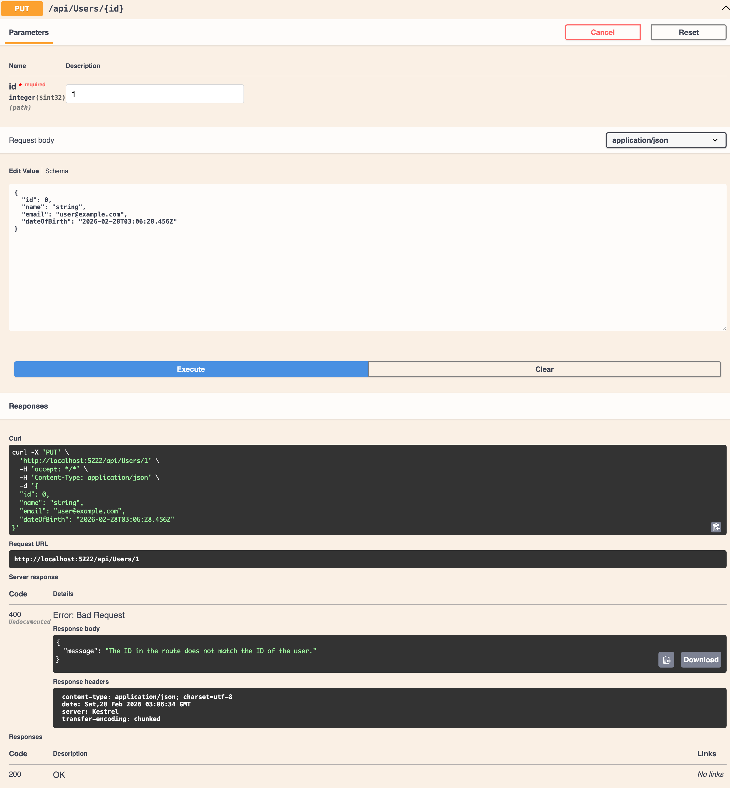
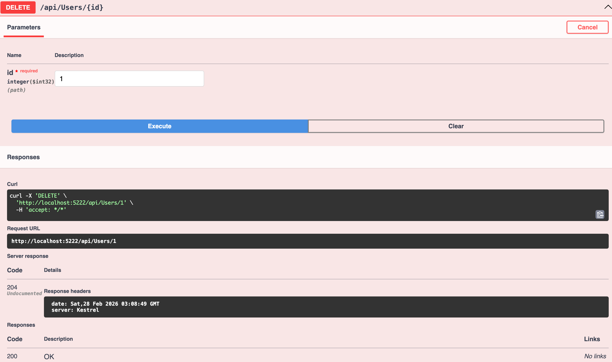

# API REST de Usuarios (ASP.NET Core + EF Core)

## 📋 Tabla de contenidos

* [Características](#-características)
* [Arquitectura del proyecto](#-arquitectura-del-proyecto)
* [Estructura real del proyecto](#-estructura-real-del-proyecto)
* [Principios SOLID aplicados](#-principios-solid-aplicados)
* [Requisitos](#-requisitos)
* [Ejecución](#-ejecución)

## ✨ Características

- API REST para gestión de usuarios.
- Operaciones CRUD completas:
	- `GET /api/users`
	- `GET /api/users/{id}`
	- `POST /api/users`
	- `PUT /api/users/{id}`
	- `DELETE /api/users/{id}`
- Persistencia con Entity Framework Core + SQLite (Code First).
- Migraciones aplicadas automáticamente al iniciar la aplicación.
- Validación de correo único a nivel de servicio y base de datos (índice único).
- Swagger habilitado en entorno de desarrollo.

## 🧱 Arquitectura del proyecto

La solución usa una arquitectura por capas simple:

- **Controllers**: exponen endpoints HTTP y devuelven respuestas REST.
- **DTOs**: contratos de entrada/salida para no exponer entidades directamente.
- **Mappers**: conversión entre DTOs y entidad de dominio.
- **Services**: lógica de negocio (validaciones, reglas de duplicado, CRUD).
- **Data**: `AppDbContext` y configuración EF Core.
- **Models**: entidad de dominio `User`.

Flujo principal:

`HTTP Request -> Controller -> Service -> DbContext (EF Core) -> SQLite`

## 🗂️ Estructura real del proyecto

```text
Tarea práctica 5 - Unidad 5/
├── README.md
├── docs/
│   └── images/
├── user-api_csharp/
│   ├── Data/
│   │   └── users.db
│   ├── Program.cs
│   ├── appsettings.json
│   ├── user-api_csharp.csproj
│   └── src/
│       ├── Controllers/
│       │   └── UsersController.cs
│       ├── DTOs/
│       │   └── UserDtos.cs
│       ├── Data/
│       │   └── AppDbContext.cs
│       ├── Interfaces/
│       │   └── IUserService.cs
│       ├── Mappers/
│       │   └── UserMapper.cs
│       ├── Migrations/
│       ├── Models/
│       │   └── User.cs
│       └── Services/
│           └── UserService.cs
└── Tarea práctica 5 - Unidad 5.slnx
```

## 🧠 Principios SOLID aplicados

- **S — Single Responsibility**
	- `UsersController` se enfoca en HTTP.
	- `UserService` centraliza la lógica de negocio.
	- `UserMapper` centraliza el mapeo DTO/entidad.

- **O — Open/Closed**
	- Puedes extender reglas de negocio en `UserService` sin romper contratos de controlador.

- **L — Liskov Substitution**
	- Se respeta al trabajar mediante contrato `IUserService`.

- **I — Interface Segregation**
	- `IUserService` expone solo operaciones necesarias del caso de uso Usuarios.

- **D — Dependency Inversion**
	- El controlador depende de la abstracción `IUserService`, no de la implementación concreta.

## ✅ Requisitos

- .NET SDK 10.0 (o superior compatible con el `TargetFramework` actual).
- CLI de `dotnet` disponible en terminal.
- Sistema operativo compatible con .NET (macOS, Linux o Windows).

## 🚀 Ejecución

1. Restaurar y compilar:

```bash
dotnet restore user-api_csharp/user-api_csharp.csproj
dotnet build user-api_csharp/user-api_csharp.csproj
```

2. Ejecutar la API:

```bash
dotnet run --project user-api_csharp/user-api_csharp.csproj
```

3. Abrir Swagger:

- `http://localhost:5222/swagger`

4. Endpoint raíz:

- `http://localhost:5222/`

### Capturas de pruebas (Swagger)

#### GET /


#### GET /api/Users


#### POST /api/Users


#### GET /api/Users/{id}


#### PUT /api/Users/{id}


#### DELETE /api/Users/{id}

